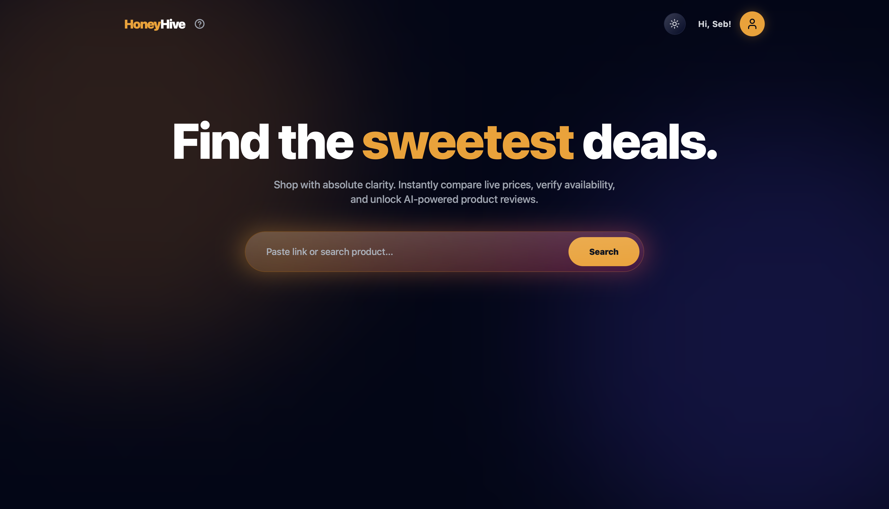
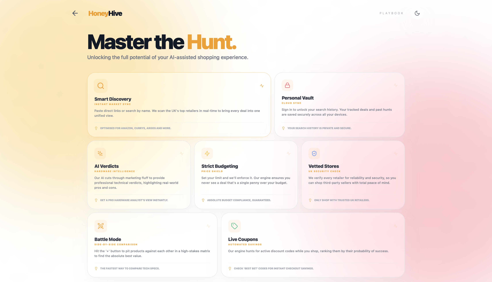
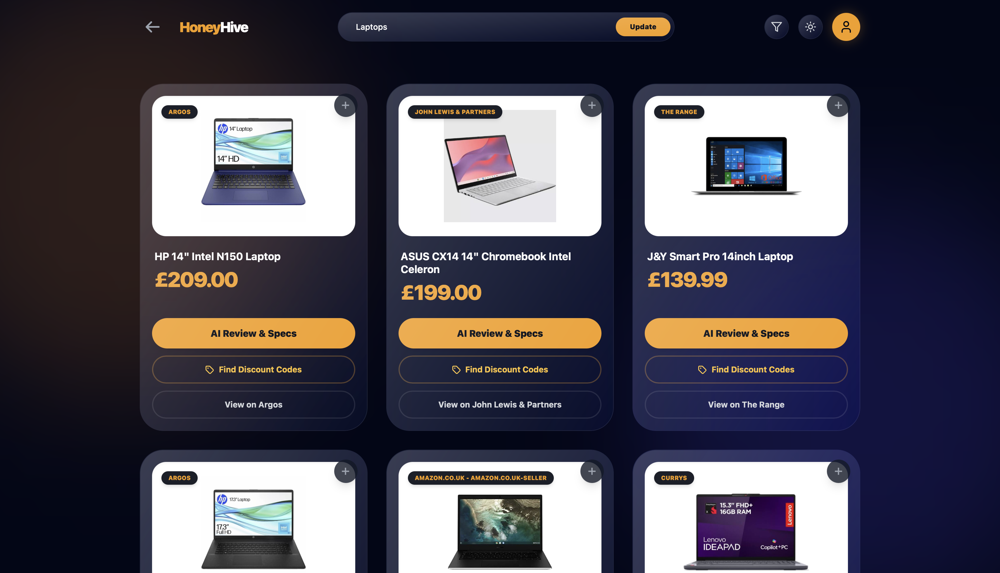
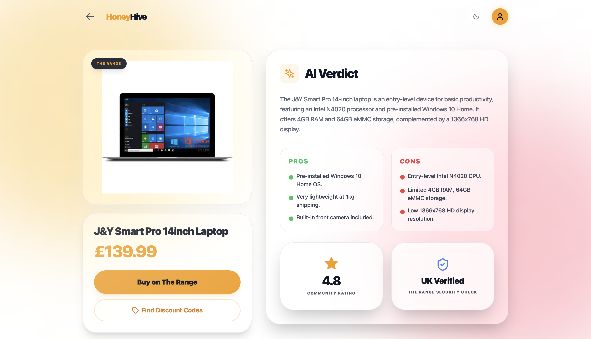
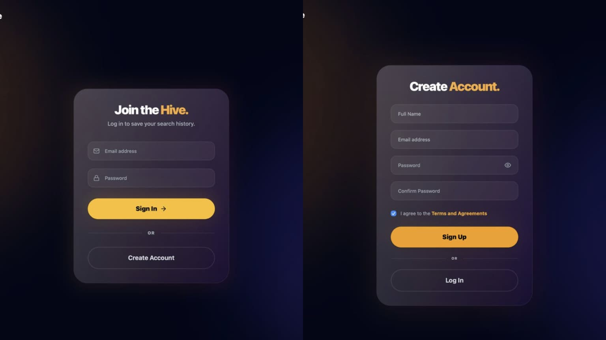
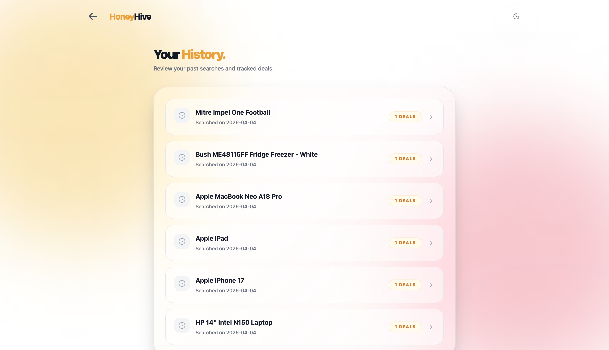
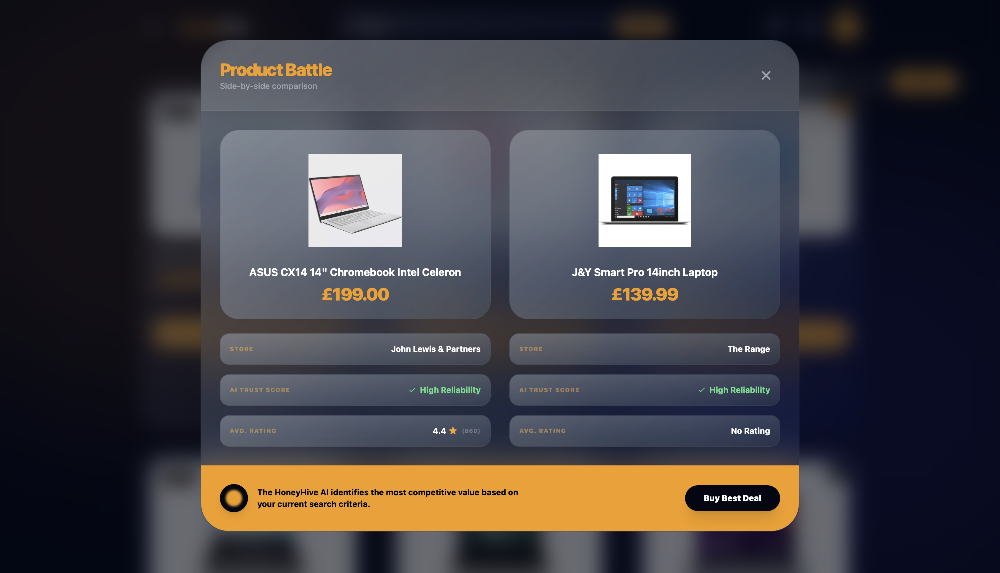
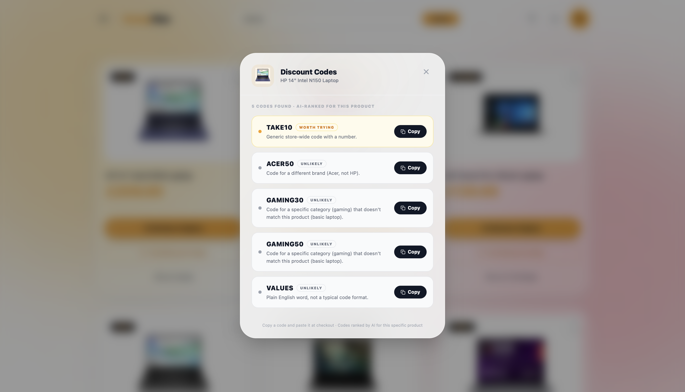
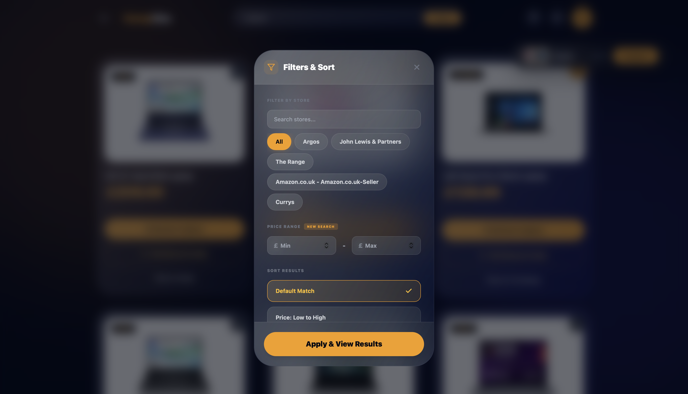

# Honey-Hive


*A decoupled full-stack architecture leveraging Large Language Models (LLMs) and automated browser orchestration for real-time market data synthesis and multi-retailer price optimisation.*

> **Portfolio Note:** This application was originally developed as a collaborative group project for a module at the University of Greenwich. This repository is a personal portfolio fork showcasing my specific architectural and full-stack contributions as the lead developer of the team.

## Live Deployment
[](https://honey-hive-frontend.vercel.app/)
[](https://honey-hive-api.onrender.com)

> **Note:** **Click the badges above** to access the live environments. Alternatively, you can use these direct links: [Live Demo (Vercel)](https://honey-hive-frontend.vercel.app/) | [API (Render)](https://honey-hive-api.onrender.com). 
>
> The backend is hosted on a Render free instance. If the site has been inactive, the initial request may require up to 30-50 seconds to "spin up" the server.

## Documentation
[](https://fantastic-guide-92jj8p4.pages.github.io/frontend/docs/ts-dist/index.html)
[](https://fantastic-guide-92jj8p4.pages.github.io/backend/docs/python-dist/index.html)

> **Note:** **Click the badges above** to access the live, auto-generated technical documentation hosted securely via GitHub Pages. 
>
> * **Frontend Docs (TS):** Explores the React component hierarchy, Vite configuration, and client-side logic.
> * **Backend Docs (Python):** Explores the FastAPI endpoints, SQLite database schemas, AI orchestration, and extraction logic.
>
> *Alternatively, you can use these direct links:* [Frontend UI Docs](https://fantastic-guide-92jj8p4.pages.github.io/frontend/docs/ts-dist/index.html) | [Backend API Docs](https://fantastic-guide-92jj8p4.pages.github.io/backend/docs/python-dist/index.html)

## Table of Contents

- [About the Project](#about-the-project)
- [Features](#features)
- [Tech Stack](#tech-stack)
- [Getting Started](#getting-started)
  - [Prerequisites](#prerequisites)
  - [Installation](#installation)
- [Usage](#usage)
- [Screenshots](#screenshots)
- [Project Structure](#project-structure)
- [AI Usage & Reflection](#ai-usage--reflection)
- [Agile Learning & Software Life Cycle](#agile-learning--software-life-cycle)
- [System Requirements & Specifications](#system-requirements--specifications)
- [Architecture & System Modelling](#architecture--system-modelling)
- [Git Workflow & Version Control](#git-workflow--version-control)
- [Testing Strategy & Quality Assurance](#testing-strategy--quality-assurance)
- [Release Changelog](#release-changelog)
- [Contributors](#contributors)
- [License](#license)

## About the Project

**Academic Context:** Originally built as a 5-person group coursework assignment, I served as the Lead Full-Stack Architect for this application. While my teammates assisted with initial UI scaffolding, documentation, and basic database schemas, I was responsible for engineering the core React frontend, the FastAPI routing, the AI integrations, and the overarching system architecture.

**The Vision:** Honey-Hive is a full-stack web application engineered to streamline the online shopping experience. It aggregates live product data, enforces strict user-defined budget constraints, generates professional technical verdicts, and autonomously scrapes the web for valid discount codes.

**The Problem it Solves:** Modern comparison platforms are frequently bloated with fake or expired coupons, unverified reviews, and sponsored listings that bypass actual user budgets. Honey-Hive circumvents these limitations by leveraging Generative AI to provide instant, unbiased product analysis. Simultaneously, a custom headless-browser engine autonomously hunts for active promotional codes hidden behind modern Client-Side Rendering (CSR) and cookie-consent layers.

**Target Audience:** Designed for deal hunters, budget-conscious consumers, and tech-savvy shoppers who demand absolute market clarity and maximum value without the friction of manually auditing dozens of retail domains.

## Features

### Core Platform Capabilities
* **Live Search & Deal Aggregation:** Queries Google Shopping data in real time to normalise market pricing across leading UK retailers.
* **AI-Powered Product Analysis:** Integrates the Google Gemini 2.5 Flash LLM to generate instant, structured technical verdicts, alongside pros, cons, and vendor reliability scores.
* **Battle Mode:** A side-by-side comparison matrix enabling users to evaluate technical specifications, live pricing, and AI-derived trust scores to secure the absolute best deal.
* **Live Coupon Scraper:** An automated headless browser engine (Playwright) that dynamically navigates cookie consent banners to scrape, extract, and AI-rank live promotional codes.

### User Experience & Security
* **Persistent User Vault:** A robust authentication architecture utilising FastAPI and SQLite (with `pbkdf2_sha256` cryptographic hashing) to securely persist search history across sessions.
* **Seamless Authentication:** Context-aware routing captures the user's exact origin state prior to authentication, seamlessly redirecting them back to their active search upon success.
* **High-Fidelity UI:** A fully responsive Glassmorphic design system featuring manual Dark/Light mode toggling, ambient background illumination, and fluid CSS-driven page transitions.
* **Visual Stability:** Deploys structured Skeleton Loading states to entirely eliminate Cumulative Layout Shift (CLS) during heavy asynchronous API fetches.

### Under the Hood (Engineering Architecture)
* **Intelligent Price Interceptor:** A custom server-side regex interception engine that strictly enforces user budget parameters before the data payload ever reaches the client.
* **Hybrid URL Extraction:** Bypasses standard keyword searches when a direct URL is supplied, natively extracting OpenGraph metadata or parsing Amazon ASINs for pinpoint extraction accuracy.
* **Graceful Degradation:** Fault-tolerant LLM fallback policies ensure that if external APIs encounter rate limits, the system safely degrades to standard URL metadata rather than triggering a critical failure.
* **Environment Parity:** Strict architectural separation of local development environments and live production cloud clusters via dynamic environment variable routing (`VITE_API_URL`).

## Tech Stack

- **Frontend:** React 19 / Vite / TypeScript / Tailwind CSS
- **Backend:** Python 3.9+ / FastAPI / SQLAlchemy / Uvicorn
- **Database:** SQLite (Local Development)
- **Version Control:** Git & GitHub
- **APIs & Tools:** Google Gemini API, SerpApi, Playwright, BeautifulSoup4

## Getting Started

### Prerequisites

- Node.js v18 or higher
- Python v3.9 or higher
- Git

### Installation

```bash
# Clone the repository
git clone https://github.com/your-org/elee1149-courswork-2025-hive.git

# Navigate to the project folder
cd elee1149-courswork-2025-hive

# 1. Backend Setup
cd backend
python -m venv venv

# Activate the virtual environment
# On Windows: venv\Scripts\activate
# On Mac/Linux: source venv/bin/activate

# Install Python dependencies and Playwright browsers
pip install -r requirements.txt
playwright install chromium

# Set up Backend Environment Variables
cp app/.env.example app/.env
# Open app/.env and insert your SERPAPI_KEY and GEMINI_API_KEY

# 2. Frontend Setup
cd ../frontend
npm install --legacy-peer-deps

# Set up Frontend Environment Variables
cp .env.example .env
```

### Usage

To run the application locally, you will need two separate terminal windows.

**Terminal 1 (Backend Server):**
```bash
# Ensure you are in the backend directory with your venv activated
cd backend
python run.py
```
*(The FastAPI server will start on http://localhost:8000)*

**Terminal 2 (Frontend Server):**
```bash
# Ensure you are in the frontend directory
cd frontend
npm run dev
```
*(The React application will be available at http://localhost:5173)*

## Screenshots

| Home Screen | Playbook | Results Screen |
| :---: | :---: | :---: |
|  |  |  |
| **Details Screen** | **Login and Sign-Up** | **History Screen** |
|  |  |  |
| **Battle Mode** | **Coupons Modal** | **Filters Modal** |
|  |  |  |

## Project Structure

```text
elee1149-courswork-2025-hive/
├── .github/                # GitHub actions and metadata
├── assets/                 # SVGs and Screenshots for documentation
├── backend/                # Python/FastAPI Application
│   ├── app/                # API routes, auth, AI models, and scraper logic
│   ├── docs/python-dist/   # Generated pdoc HTML technical documentation
│   ├── honeyhive.db        # Local SQLite Database
│   ├── requirements.txt    # Backend Python dependencies
│   └── run.py              # Backend server entry point
├── frontend/               # React/Vite Application
│   ├── docs/ts-dist/       # Generated TypeDoc HTML UI documentation
│   ├── src/                # React UI Components and client-side logic
│   ├── .vercel/            # Vercel deployment configuration
│   ├── .env.example        # Environment variables template
│   ├── index.html          # HTML entry point
│   ├── package.json        # Frontend dependencies and build scripts
│   └── tailwind.config.js  # UI Theme configuration
├── .gitignore              # Version control ignore rules
├── CHANGELOG.md            # Version history and semantic commits
├── GenAIReflection.md      # Detailed AI usage reflection and prompt log
├── LICENSE                 # Project License
├── README.md               # Project README
├── Requirements.md         # Requirements Specification
├── SoftwareLifecycle.md    # Agile SDLC and sprint reflections
├── SystemModelling.md      # UML diagrams & Architectural decisions
├── Testing.md              # Test plans and validation results
└── Workflow.md             # Development workflow and commit strategy
```

## AI Usage & Reflection

Some parts of this project were developed with the help of AI tools (e.g., Google Gemini). All AI-generated content was reviewed, modified where necessary, and has been appropriately cited.

A detailed critical reflection, including representative prompts, evaluation of AI suggestions, encountered limitations, and the influence on our software engineering decision-making, can be found in the dedicated documentation file:

**[View GenAI Reflection](./GenAIReflection.md)**
## Agile Learning & Software Life Cycle

The development of Honey-Hive was driven by an Agile learning methodology, allowing the team to iteratively build, test, and reflect upon each phase of the Software Development Life Cycle (SDLC). By treating each sprint as an opportunity for both technical advancement and continuous feedback, we dynamically adapted our workflows to tackle complex integrations like the Gemini AI LLM and headless browser scraping. This document details our iterative processes, sprint reflections, and the complete life cycle of the application from conception to deployment.

**[View Agile Learning & SDLC Documentation](./SoftwareLifecycle.md)**
## System Requirements & Specifications

This project adheres to strict functional and non-functional requirements to ensure a robust and scalable architecture. The documentation outlines the core user stories, use cases, and the hybrid extraction and redirection logic powering the Honey-Hive platform.

**[View Requirements Specification](./Requirements.md)**

## Architecture & System Modelling

To bridge the gap between concept and implementation, comprehensive system modelling was conducted prior to development. This document details the architectural design, system context mapping, and database schema models that dictate the decoupled data flow between the React frontend and FastAPI backend.

**[View System Modelling](./SystemModelling.md)**

## Git Workflow & Version Control

Maintaining a clean and traceable codebase is critical for effective team collaboration. Our version control strategy documents the strict branching protocols, pull request review requirements, and continuous integration standards utilised to prevent deployment conflicts.

**[View Git Workflow](./Workflow.md)**

## Testing Strategy & Quality Assurance

Ensuring the security and reliability of the Honey-Hive platform is a primary objective. This document outlines our QA protocols, automated testing frameworks, and the specific mitigation strategies implemented to resolve critical application vulnerabilities discovered during the development lifecycle.

**[View Testing Strategy](./Testing.md)**

## Release Changelog

A meticulous record of all structural changes, feature merges, and bug fixes is maintained to provide full traceability of the software's evolution from initial scaffolding to final production deployment.

**[View Release Changelog](./CHANGELOG.md)**

## Contributors

| Username | Contribution |
| :--- | :--- |
| **SriVigneswaran7** | Architected and developed the entire React frontend, including all core UI views, the dynamic Battle Mode comparison engine, and the complete client-server JSON API integration across all screens. Integrated the SQLite persistence layer and developed the core backend search engine, orchestrating real-time data via SerpApi and Gemini AI alongside a custom server-side Price Interceptor. Managed dual-environment routing for cloud deployments. Authored and directed the end-to-end SDLC documentation, generating live static technical websites (pdoc/TypeDoc) and finalising all requirements, system models, Git workflows, release changelogs, and the project README. |
| **Ketchup256** | Developed the backend extraction logic and assisted in the development of search logic as well as Playwright coupon engine. Built the Coupons UI. Authored the Testing Strategy and  Code Documentation. With addition to security testing and resolving application vulnerabilities. |
| **Hachem512** | Designed and implemented the FastAPI database schema, persistence layer, and SQLAlchemy models for user authentication and history tracking. |
| **vez767** | Contributed to initial UI prototyping for History and Sign-Up screens. Developed early client-side sorting logic and assisted with frontend-backend integration scaffolding for the said screens. |
| **brahemrifi9** | Assisted with initial drafts of System Modelling and context generation for the project README. |

## License

Distributed under the **MIT License**. See [`LICENSE`](./LICENSE) for more information.

---

*This repository is for portfolio and demonstration purposes only. If you are a student currently enrolled in a similar module, please ensure you adhere to your institution's academic integrity policies before referencing this code.*

