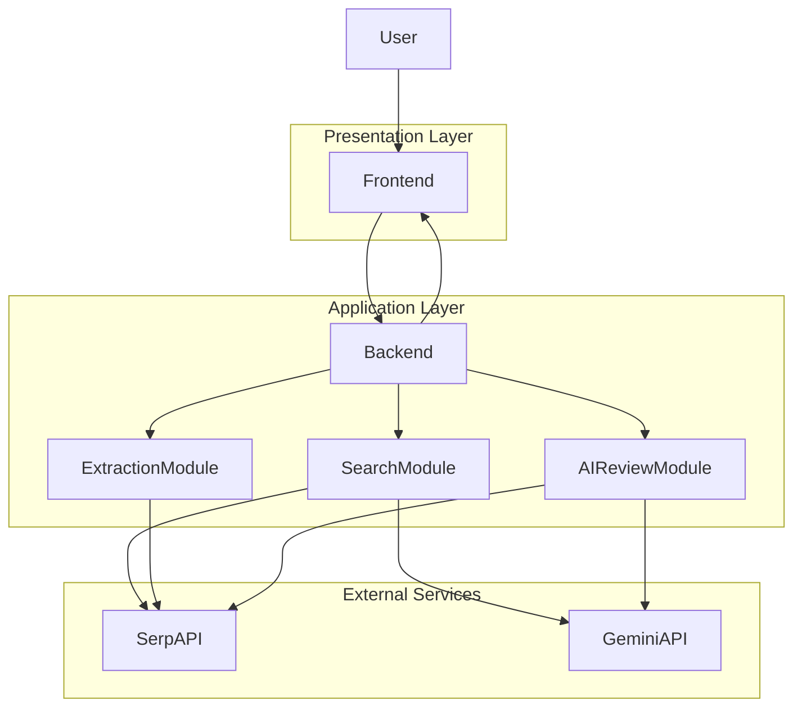

# Honey-Hive System Modelling

## 1. Overview

This document presents the **system modelling** for the **ELEE1149 group coursework project**. The system, named **Honey-Hive**, is a web-based product comparison and review assistant that allows a user to input either a **product name** or a **product URL**, retrieve matching product offers, and generate **AI-assisted product insights**.

The modelling in this document reflects both the **current implementation** and the **intended system design** described in the project requirements.

The current implementation already includes:

- **Flask backend API**
- **Product search workflow**
- **Amazon URL extraction**
- **Google Shopping queries via SerpAPI**
- **AI-generated product insights using Gemini**

The purpose of this modelling document is to demonstrate how the system aligns with **software engineering principles** by clearly communicating:

- **System structure**
- **System behaviour**
- **Design decisions**
- **Component responsibilities**

---

## 2. System Context

The system is designed as a **web application** consisting of **three main architectural layers**.

### 2.1 Presentation Layer

The **frontend interface** provides the interaction point for the user.

**Responsibilities include:**

- Collecting **user input**
- Sending **requests to the backend**
- Displaying **product comparison results**
- Presenting **AI-generated insights**

---

### 2.2 Application Layer

The **Flask backend API** acts as the **central processing component**.

**Responsibilities include:**

- Handling **API routing**
- Performing **input validation**
- Executing **business logic**
- Orchestrating interactions with **external services**

---

### 2.3 Service Layer

The system relies on **external APIs** to provide **product search** and **AI processing capabilities**.

**External services include:**

- **SerpAPI** — used for retrieving **product search results**
- **Gemini AI** — used for generating **structured AI-based product insights**

---

### 2.4 Primary User Goal

The **primary user goal** is to quickly compare a product by entering either:

**A product search query**

Example:

```
Sony WH-1000XM5 headphones
```

or

**A direct product URL**

Example:

```
Amazon product link
```

The system retrieves **matching product offers** and optionally generates **AI-assisted product insights**.

---

## 3. Architectural Style and Design Justification

The system follows a **client–server architecture** with a **modular backend design**.

The architecture separates the system into **clearly defined responsibilities**.

| Layer | Responsibility |
|------|------|
| Frontend | Collect user input and present results |
| Backend API | Process requests and perform routing logic |
| External Services | Provide search results and AI processing |

This architectural separation improves:

- **Maintainability**
- **Scalability**
- **System clarity**

---

## 3.1 Architectural Justification

### Separation of Concerns

The **frontend** is responsible for presentation and interaction, while the **backend** performs processing and decision-making. This separation reduces coupling and improves **system maintainability**.

### Modularity

The backend logic is divided into **specialised modules**, allowing individual components to be developed, tested, and maintained independently.

## 3.2 Architectural Decisions and Requirement Alignment

The architectural design of **Honey-Hive** is aligned with both **functional** and **non-functional requirements**.

### Module Responsibilities

| Module | Responsibility |
|------|------|
| `server.py` | API routing and request handling |
| `search.py` | Search optimisation and shopping queries |
| `extract.py` | Amazon product URL extraction |

This **modular structure** improves:

- **Readability**
- **Maintainability**
- **Extensibility**

---

### Scalability

External services such as **SerpAPI** and **Gemini AI** are used to offload computationally intensive tasks.

**Benefits include:**

- Reduced **server processing load**
- Improved **response times**
- Simplified **system scalability**

---

### Reliability

The backend performs **validation checks** and **exception handling** when communicating with external services, preventing system failures when APIs return unexpected responses.

---

### Maintainability

Separating system responsibilities into **small modules** allows developers to modify **individual features** without affecting other system components.

---

## 3.2 Architectural Decisions and Requirement Alignment

The architectural design of **Honey-Hive** is aligned with both **functional** and **non-functional requirements**.

### External API Integration

The system relies on **SerpAPI** and **Gemini AI** to perform **product search** and **AI-based review analysis**.

Delegating these tasks to specialised services improves **system scalability** and removes the need for complex **web scraping** or **natural language processing infrastructure**.

---

### Modular Backend Design

The backend is structured as **independent modules** (`search.py`, `extract.py`, and AI insight generation).

This modular design allows each component to **evolve independently** and improves **system extensibility**.

---

### Client–Server Architecture

Separating the **frontend** from the **backend API** allows the system to support **multiple future clients**, including:

- Web interfaces
- Mobile applications
- Third-party integrations

---

### Fault Tolerance

External API calls are **encapsulated inside backend modules**.

Validation and **error handling mechanisms** ensure that failures in external services do **not cause system-wide crashes**.

---

These architectural decisions collectively support:

- **Scalability**
- **Reliability**
- **Maintainability**

---

## 4. High-Level System Architecture


Explanation

The user interacts with the frontend interface.

The frontend sends a request to the Flask backend.

The backend determines how to process the input.

The backend communicates with external services.

Results are returned to the frontend in JSON format.

5. Functional Decomposition

The backend system is divided into functional components.

5.1 Server Layer

Responsible for:

handling API requests

validating input

routing requests to appropriate modules

returning JSON responses

5.2 Search Module
