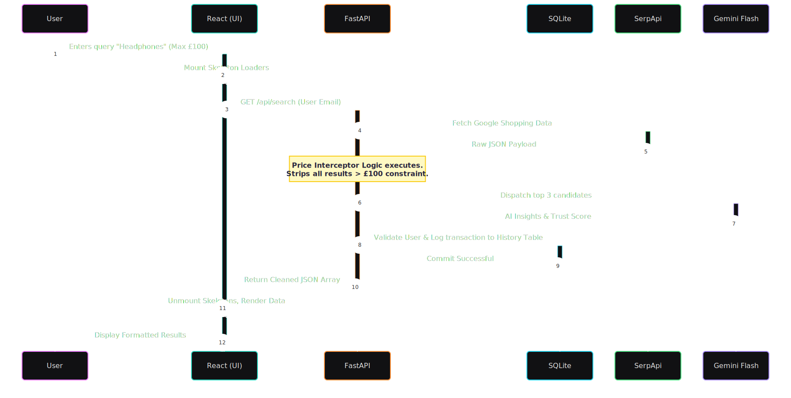

# Honey-Hive: System Modelling & Architecture

## 1. Overview
This document outlines the formal system modelling for the **Honey-Hive** platform. It demonstrates the structural and behavioural design of the application, reflecting a mature software engineering approach. 

Honey-Hive is an AI-assisted product comparison platform. To meet the non-functional requirements for high performance and scalability, the architecture transitions away from monolithic, synchronous frameworks (such as Flask) in favour of a highly decoupled, asynchronous **FastAPI** backend and a **React (Vite)** frontend. This design natively supports non-blocking I/O operations, which is critical when orchestrating multiple external services like SerpApi and Google's Gemini LLM.

The models below articulate our system structure, dynamic behaviour, data persistence, and the engineering justifications behind these choices.

---

## 2. High-Level System Architecture (Container Model)
The system employs a strict **Client–Server Architecture**, divided into four distinct logical zones: Presentation, Application, Data, and External Services. 

The following UML Component Diagram illustrates how these layers interact. We utilise a Left-to-Right (`LR`) flow with heavily weighted data-paths to accurately represent the typical lifecycle of a web request.

### 2.1 Component Responsibilities
By mapping our logical components to our physical file tree, we ensure strict traceability between design and implementation.

* **Frontend (`frontend/src/`):** Manages user state, authentication persistence (via `localStorage`), and renders the Glassmorphic UI. Components like `Results.tsx` and `Comparison.tsx` are strictly responsible for presentation, containing no business logic.
* **API Router (`backend/app/main.py` & `run.py`):** Acts as the primary entry point, managed by Uvicorn. It handles middleware, CORS policy, and routes incoming HTTP requests to specialised service modules.
* **Search & Interceptor (`backend/app/search.py`):** Handles SerpApi communication. Critically, it contains our custom regex-based **Price Interceptor**, enforcing strict user budget constraints before data is ever returned to the client.
* **AI Extraction (`backend/app/extract.py` & `backend/app/search.py`):** Passes normalised market data to Gemini 2.5 Flash to distil unstructured product reviews into structured pros, cons, and vendor trust scores.
* **Coupon Engine (`backend/app/coupons.py`):** Dynamically scrapes live promotional codes using Playwright and BeautifulSoup, falling back to Google Search, before ranking them with AI.

---

## 3. Dynamic System Behaviour (Sequence Model)
To understand the system's runtime behaviour, we map the flow of data through the architecture. This diagram uses lifeline activations (the solid vertical blocks on the transaction lines) to explicitly demonstrate processing states and system bottlenecks during an authenticated search.

### 3.1 Behavioural Justification
This sequence highlights two critical engineering decisions:
1.  **Optimistic UI:** The frontend renders Skeleton states immediately (Step 2) before the backend completes its processing. This ensures zero layout shift and provides a highly responsive perceived performance.
2.  **Server-Side Filtering:** The Price Interceptor logic occurs entirely on the backend (Step 7) rather than the frontend. This minimises the size of the JSON payload transmitted over the network and prevents clients from reverse-engineering restricted search results.

---

## 4. Data Modelling (Entity-Relationship Model)
The system requires persistent storage for user accounts and search history. We utilise a relational model managed by **SQLAlchemy** (`backend/app/models.py`) to map Python objects to our **SQLite** database (`backend/honeyhive.db`).

### 4.1 Data Architecture Decisions
* **Referential Integrity:** The `user_inputs` table employs a Foreign Key (`user_id`) bound to the `users` table. This guarantees that relational data remains consistent and allows for cascading deletions (via `cascade="all, delete-orphan"`) if a user account is removed.
* **Security:** Plain text passwords are never stored. The `password_hash` column stores cryptographically salted hashes using the `pbkdf2_sha256` algorithm, mitigating the risk of credential exposure in the event of a database compromise.

---

## 5. Architectural Style and Design Justification
The architectural design of Honey-Hive is strictly aligned with the functional and non-functional requirements of the project. To achieve a highly maintainable and scalable system, we evaluated the trade-offs of our chosen stack:

### 5.1 Why FastAPI over Flask?
While initial requirements proposed a Flask backend, the system was upgraded to FastAPI. Because Honey-Hive relies heavily on two external APIs (SerpApi and Gemini), a synchronous framework like Flask would block the main thread while waiting for Google to respond. FastAPI’s native `async/await` support allows the server to handle concurrent user requests even while waiting for LLM generation, drastically improving horizontal scalability.

### 5.2 Fault Tolerance and Boundary Protection
External services are inherently unreliable. Our architecture encapsulates the SerpApi and Gemini calls within dedicated modules (`search.py` and `extract.py`). We implement rigorous `try/except` blocks and input validation via Pydantic schemas. If Gemini goes down, the system gracefully degrades-returning the product search results with a generic, professional fallback message rather than crashing the entire application.

### 5.3 Modularity and Extensibility
By decoupling the application into a Presentation Layer (React) and an Application Layer (FastAPI), we achieve high extensibility. Should the project require a mobile application in the future, the React Native codebase could plug directly into the existing FastAPI routing layer without requiring a single line of backend code to be rewritten.

### 5.4 Hybrid Extraction & Redirection Logic
To balance broad market coverage with high-fidelity accuracy, Honey-Hive utilises a dual-path logic for product redirection and data sourcing:

* **Discovery Path (Keyword-based):** For general queries (e.g., "Standard Headphones"), the system prioritises **Market Aggregation**. The primary "Buy" action redirects users to **Google Shopping** results. This architectural choice provides the widest possible range of price comparisons and vendor options without the overhead of maintaining custom scrapers for every individual boutique retailer.

* **Precision Path (Direct Link):** When processing a specific, high-intent URL (facilitated via the `extract.py` module), the system shifts to **Deep Extraction**. In this mode, the scraper bypasses aggregators to interface directly with the vendor's **Document Object Model (DOM)**. This enables the retrieval of granular data-including exact SKU pricing and technical specifications—directing the user straight to the final product checkout page.

### 5.5 Environment Parity and Dual Deployment Architecture
To ensure a robust development lifecycle and safe production releases, Honey-Hive employs a strict **Environment Parity** model. The React frontend is engineered to dynamically route API requests using build-time environment variables (`VITE_API_URL`). 

* **Local Environment:** During local development, the frontend interfaces with a local Uvicorn instance (`localhost:8000`) and a local SQLite database (`honeyhive.db`), allowing for destructive testing without consequence.
* **Production Environment:** When deployed, the Vercel-hosted frontend automatically redirects traffic to the live, cloud-hosted Render backend cluster. 

This dual-deployment strategy guarantees complete isolation of user data and search history between testing and live environments, ensuring that experimental local changes cannot corrupt the production database.

* **Automated Build Pipeline:** The system utilises a Git-integrated CI/CD pipeline. Pushing to the main branch triggers an automated build process on Vercel (Frontend) and Render (Backend), ensuring that the live deployment is always a direct reflection of the verified codebase.

### 5.6 Volatile State Management (Battle Mode)
The "Battle Mode" comparison engine utilises **React Component State** rather than database persistence. This architectural choice ensures that product comparisons are high-speed and consume zero server overhead. The comparison queue is ephemeral, clearing on a full page reload to maintain a lightweight browser memory footprint.

### 5.7 Resilience & Graceful Degradation
To handle the inherent unreliability of external LLM providers, the system implements a **Graceful Degradation Policy**. If the Gemini API reaches rate limits or becomes unresponsive, the `generate_ai_insights` controller automatically triggers a fallback mechanism. This ensures the user is presented with standardised technical metadata derived from the product URL rather than encountering a system-wide failure.

### 5.8 Standardised Documentation Strategy (KDocs/TSDocs)
To satisfy the requirements for high maintainability, the codebase adheres to strict documentation standards:
* **Frontend:** Components utilise **TSDoc** to define interface props and state logic.
* **Backend:** Python modules utilise **Docstrings** and **Type Hinting** to document API route expectations and scraper return types.
This ensures that the Honey-Hive platform is transparent and accessible for future engineering handovers.