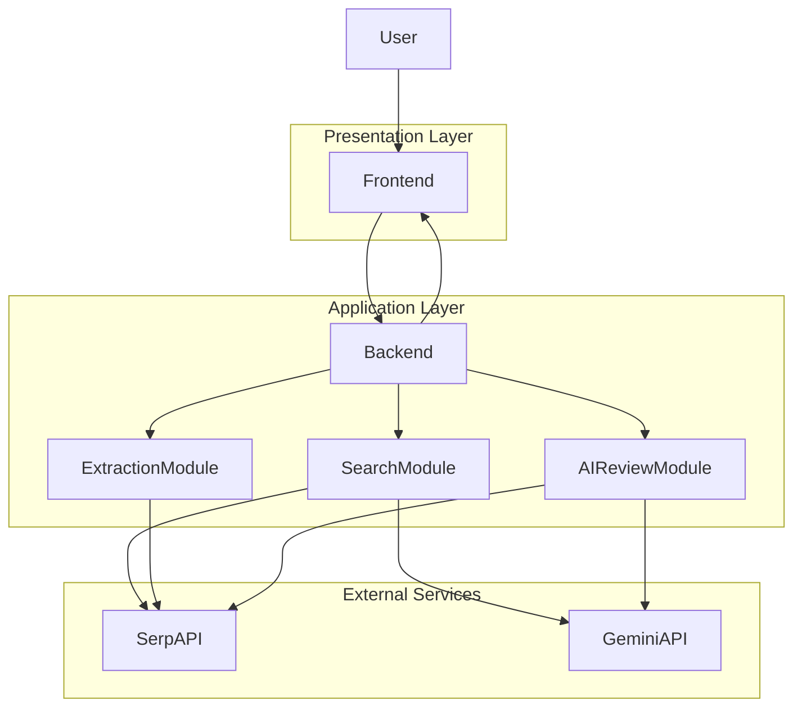

SystemModelling.md
1. Overview

This document presents the system modelling for the ELEE1149 group coursework project. The system is a web-based product comparison and review assistant that allows a user to input either a product name or a product URL, retrieve matching product offers, and generate AI-assisted product insights.

The modelling in this document reflects both the current implementation and the intended system design described in the requirements. The current implementation already includes a Flask backend, a search workflow, Amazon URL extraction, Google Shopping search through SerpAPI, and AI-generated product insights using Gemini.

The system modelling aims to demonstrate how the project aligns with software engineering principles by clearly communicating system structure, behaviour, and design decisions.

2. System Context

The system is designed as a web application consisting of three main layers:

Presentation Layer

Frontend user interface

Handles user input and displays results

Application Layer

Flask backend API

Handles routing, validation, processing logic, and API orchestration

Service Layer

External APIs providing product search and AI functionality

Main User Goal

The user wants to quickly compare a product by entering either:

a product search query (e.g., “Sony WH-1000XM5 headphones”), or

a direct product URL (e.g., an Amazon product link)

The system retrieves product offers and optionally generates AI-based product insights.

3. Architectural Style and Justification

The system follows a client-server architecture with a modular backend design.

The architecture separates the system into the following responsibilities:

| Layer             | Responsibility                           |
| ----------------- | ---------------------------------------- |
| Frontend          | Collect user input and present results   |
| Backend API       | Process requests, perform routing logic  |
| External Services | Provide search results and AI processing |

This separation improves maintainability, scalability, and clarity of system behaviour.

3.1 Architectural Justification
Separation of Concerns

The frontend is responsible for presentation and interaction, while the backend handles processing and decision-making. This separation reduces coupling and makes the system easier to maintain.

Modularity

The backend logic is divided into dedicated modules:

| Module       | Responsibility                                    |
| ------------ | ------------------------------------------------- |
| `server.py`  | API routing and request handling                  |
| `search.py`  | Search optimisation, shopping search, AI insights |
| `extract.py` | Amazon product link extraction                    |

This modular structure improves maintainability and readability.

Scalability

External APIs such as SerpAPI and Gemini AI are used to offload heavy processing tasks.

Benefits include:

Reduced computational load on the local server

Faster response times

Ability to scale without implementing complex scraping infrastructure

Reliability

The backend performs validation checks and exception handling when communicating with external services. This prevents system crashes when external API responses fail.

Maintainability

Separating the system into small, specialised modules makes it easier for developers to modify individual features without affecting other components.

4. High-Level System Architecture

