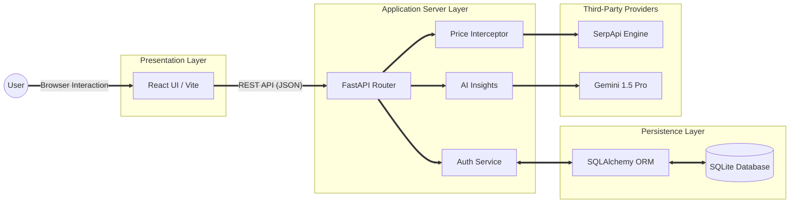
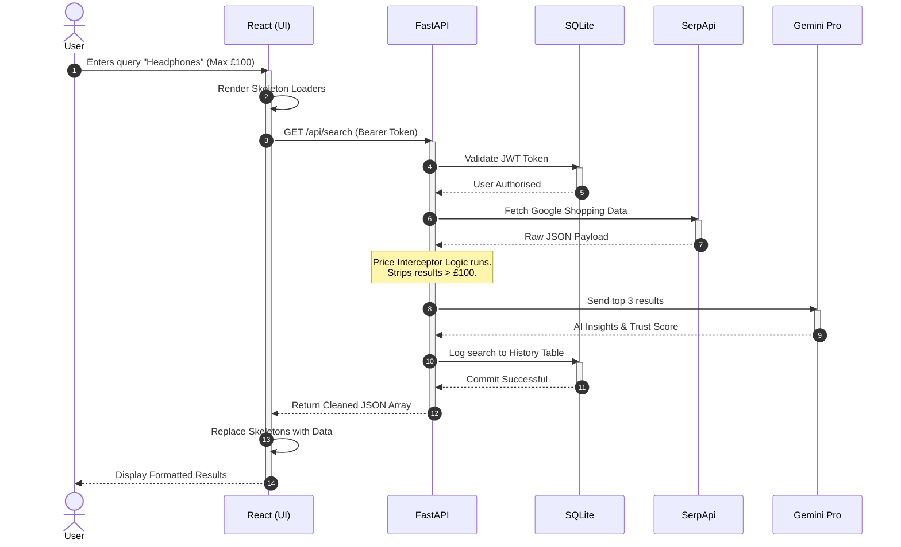
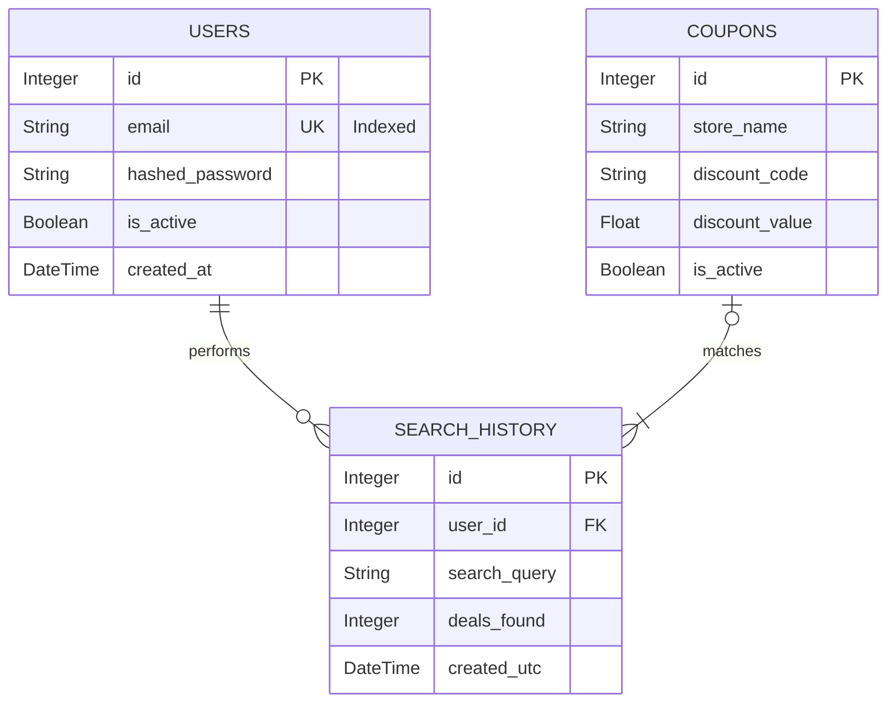

# Honey-Hive: System Modelling & Architecture

## 1. Overview
This document outlines the formal system modelling for the **Honey-Hive** platform. It demonstrates the structural and behavioural design of the application, reflecting a mature software engineering approach. 

Honey-Hive is an AI-assisted product comparison platform. To meet the non-functional requirements for high performance and scalability, the architecture transitions away from monolithic, synchronous frameworks (such as Flask) in favour of a highly decoupled, asynchronous **FastAPI** backend and a **React (Vite)** frontend. This design natively supports non-blocking I/O operations, which is critical when orchestrating multiple external services like SerpApi and Google's Gemini LLM.

The models below articulate our system structure, dynamic behaviour, data persistence, and the engineering justifications behind these choices.

---

## 2. High-Level System Architecture (Container Model)
The system employs a strict **Client–Server Architecture**, divided into four distinct logical zones: Presentation, Application, Data, and External Services. 

The following UML Component Diagram illustrates how these layers interact. We utilise a Left-to-Right (`LR`) flow with heavily weighted data-paths to accurately represent the typical lifecycle of a web request.

### 2.1 Component Responsibilities
By mapping our logical components to our physical file tree, we ensure strict traceability between design and implementation.

* **Frontend (`frontend/src/`):** Manages user state, authentication persistence (via `sessionStorage`), and renders the Glassmorphic UI. Components like `Results.tsx` and `ComparisonTable.tsx` are strictly responsible for presentation, containing no business logic.
* **API Router (`backend/app/main.py`):** Acts as the primary entry point, managed by Uvicorn. It handles middleware, CORS policy, and routes incoming HTTP requests to specialised service modules.
* **Search & Interceptor (`backend/app/search.py`):** Handles SerpApi communication. Critically, it contains our custom regex-based **Price Interceptor**, enforcing strict user budget constraints before data is ever returned to the client.
* **AI Extraction (`backend/app/extract.py`):** Passes normalised market data to Gemini 1.5 Pro to distil unstructured product reviews into structured pros, cons, and vendor trust scores.

---

## 3. Dynamic System Behaviour (Sequence Model)
To understand the system's runtime behaviour, we map the flow of data through the architecture. This diagram uses lifeline activations (the solid vertical blocks on the transaction lines) to explicitly demonstrate processing states and system bottlenecks during an authenticated search.

### 3.1 Behavioural Justification
This sequence highlights two critical engineering decisions:
1.  **Optimistic UI:** The frontend renders Skeleton states immediately (Step 2) before the backend completes its processing. This ensures zero layout shift and provides a highly responsive perceived performance.
2.  **Server-Side Filtering:** The Price Interceptor logic occurs entirely on the backend (Step 7) rather than the frontend. This minimises the size of the JSON payload transmitted over the network and prevents clients from reverse-engineering restricted search results.

---

## 4. Data Modelling (Entity-Relationship Model)
The system requires persistent storage for user accounts and search history. We utilise a relational model managed by **SQLAlchemy** (`backend/app/models.py`) to map Python objects to our **SQLite** database (`backend/honeyhive.db`).

### 4.1 Data Architecture Decisions
* **Referential Integrity:** The `SEARCH_HISTORY` table employs a Foreign Key (`user_id`) bound to the `USERS` table. This guarantees that relational data remains consistent and allows for cascading deletions if a user account is removed.
* **Security:** Plain text passwords are never stored. The `hashed_password` column stores cryptographically salted hashes using the `bcrypt` algorithm, mitigating the risk of credential exposure in the event of a database compromise.

---

## 5. Architectural Style and Design Justification
The architectural design of Honey-Hive is strictly aligned with the functional and non-functional requirements of the project. To achieve a highly maintainable and scalable system, we evaluated the trade-offs of our chosen stack:

### 5.1 Why FastAPI over Flask?
While initial requirements proposed a Flask backend, the system was upgraded to FastAPI. Because Honey-Hive relies heavily on two external APIs (SerpApi and Gemini), a synchronous framework like Flask would block the main thread while waiting for Google to respond. FastAPI’s native `async/await` support allows the server to handle concurrent user requests even while waiting for LLM generation, drastically improving horizontal scalability.

### 5.2 Fault Tolerance and Boundary Protection
External services are inherently unreliable. Our architecture encapsulates the SerpApi and Gemini calls within dedicated modules (`search.py` and `extract.py`). We implement rigorous `try/except` blocks and input validation via Pydantic schemas. If Gemini goes down, the system gracefully degrades—returning the product search results with a generic fallback message rather than crashing the entire application.

### 5.3 Modularity and Extensibility
By decoupling the application into a Presentation Layer (React) and an Application Layer (FastAPI), we achieve high extensibility. Should the project require a mobile application in the future, the React Native codebase could plug directly into the existing FastAPI routing layer without requiring a single line of backend code to be rewritten.
